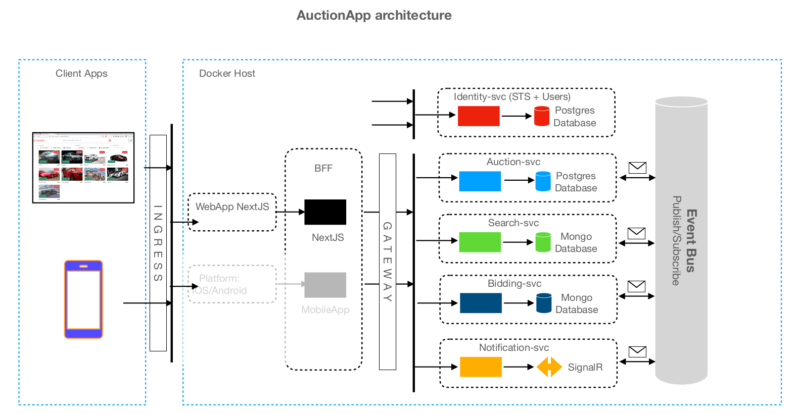

# Microservices

This repo contains code for a system built while completing a Udemy course on microservices.
The system is bundled as an application called "Carsties"; the concept is that of a car auction site and the name is word-play on the auction house, "Christie's"

Requirements to run the system
- Docker
- Node JS version 18.17 or higher

To run the system
1. Clone the repo to your local machine
2. Navigate to the root directory and run `docker compose up -d`. This will start the containers for the backend services are running in docker
3. Navigate to `./frontend/web-app` and run `npm install` (or use your favorite package manager)
4. Run `npm run dev` to start the Next JS application

## Troubleshooting:

No results are coming back: I've seen an issue with MondoDB EF connecting for the Search service. Restarting the docker containers with `docker compose down` and then rerunning the `up` command seemed to fix it.

Next JS timing out: again, a simple restart of the app seemed to fix that.